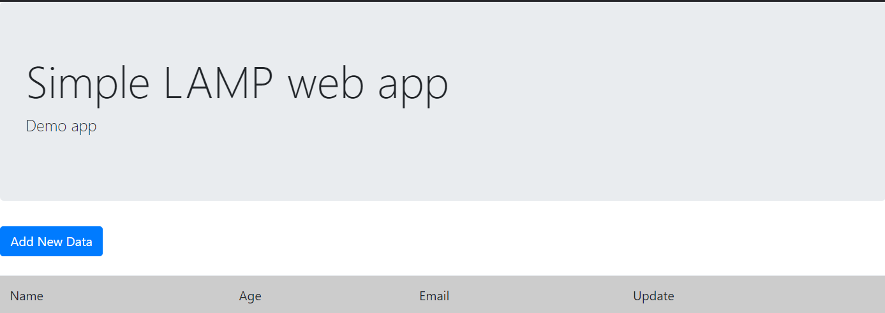

# **practica-1.3**
## Despliegue de una aplicación web LAMP sencilla

Este documento técnico describe los pasos y archivos necesarios para la instalación y configuración de un entorno LAMP en Ubuntu, así como el despliegue de una aplicación web. La práctica se ha estructurado en carpetas y archivos, con scripts que automatizan el proceso.

Esta es la estructura que tenemos de carpetas y archivos:

```bash
practica-1.3/
├── README.md
├── conf/
│   └── 000-default.conf
├── scripts/
│   ├── .env
│   ├── install_lamp.sh
│   └── deploy.sh
└── php/
    └── index.php
```
## Descripción de carpetas y archivos:

conf/: Contiene archivos de configuración de Apache.
000-default.conf: Archivo de configuración para el sitio por defecto de Apache.

scripts/: Incluye scripts de instalación y despliegue del entorno LAMP y la aplicación web.
.env: Archivo de entorno con variables de configuración para la base de datos y phpMyAdmin.

install_lamp.sh: Script para instalar Apache, PHP, y MySQL, y configurar el servidor web.
deploy.sh: Script para clonar y desplegar la aplicación web desde un repositorio.

php/: Contiene un script de prueba PHP para verificar la configuración de PHP en el servidor.
index.php: Archivo de prueba que muestra la configuración PHP.

## Contenido de los archivos:

#### Archivo conf/000-default.conf:

Este archivo configura el host virtual para el servidor Apache. Utiliza el puerto 80 y define la raíz del documento como /var/www/html.

```bash
<VirtualHost *:80>
    ServerAdmin webmaster@localhost
    DocumentRoot /var/www/html/

    DirectoryIndex index.php index.html

    ErrorLog ${APACHE_LOG_DIR}/error.log
    CustomLog ${APACHE_LOG_DIR}/access.log combined
</VirtualHost>
```

#### Archivo scripts/.env:

Este archivo define variables de entorno para configurar el acceso a la base de datos y phpMyAdmin.

```bash
# Configuración de las variables de entorno:
PHPMYADMIN_APP_PASSWORD=usuario
DB_USER=usuario
DB_PASSWORD=usuario
DB_NAME=basededatos
```

#### Script scripts/install_lamp.sh:

Este script instala y configura Apache, MySQL y PHP en el servidor. Además, copia los archivos de configuración necesarios y permite que el servidor Apache maneje PHP.

```bash
#!/bin/bash

# Detiene la ejecución si hay un error
set -ex

# Actualización de los repositorios
apt update

# Instalación del Servidor Apache
apt install apache2 -y

# Reinicio de Apache
sudo systemctl restart apache2

# Habilitación del módulo rewrite en Apache
a2enmod rewrite

# Copia el archivo de configuración a Apache
cp ../conf/000-default.conf /etc/apache2/sites-available

# Instalación de PHP y módulos necesarios
apt install php libapache2-mod-php php-mysql -y

# Instalación de MySQL Server
apt install mysql-server -y

# Reinicio de Apache después de la instalación de PHP y MySQL
sudo systemctl restart apache2

# Copia el archivo de prueba PHP a la raíz web
cp ../php/index.php /var/www/html

# Ajusta permisos en el directorio raíz de Apache
chown -R www-data:www-data /var/www/html
```

#### Script scripts/deploy.sh:

Este script despliega la aplicación web en el servidor. Configura la base de datos y ajusta el archivo config.php de la aplicación según las variables de entorno.

```bash
#!/bin/bash

# Importa el archivo de variables de entorno
source .env

# Detiene la ejecución si hay un error
set -ex

# Elimina cualquier instalación previa en /tmp
rm -rf /tmp/iaw-practica-lamp

# Clona el repositorio de la aplicación
git clone https://github.com/josejuansanchez/iaw-practica-lamp.git /tmp/iaw-practica-lamp

# Mueve el código fuente de la aplicación a la raíz web
mv /tmp/iaw-practica-lamp/src/* /var/www/html

# Actualiza el archivo de configuración de la aplicación con las variables del entorno
sed -i "s/database_name_here/$DB_NAME/" /var/www/html/config.php
sed -i "s/username_here/$DB_USER/" /var/www/html/config.php
sed -i "s/password_here/$DB_PASSWORD/" /var/www/html/config.php

# Configura la base de datos
mysql -u root <<<"DROP DATABASE IF EXISTS $DB_NAME"
mysql -u root <<<"CREATE DATABASE $DB_NAME"

# Crea el usuario y asigna permisos a la base de datos
mysql -u root <<< "DROP USER IF EXISTS '$DB_USER'@'%'"
mysql -u root <<< "CREATE USER '$DB_USER'@'%' IDENTIFIED BY '$DB_PASSWORD'"
mysql -u root <<< "GRANT ALL PRIVILEGES ON $DB_NAME.* TO '$DB_USER'@'%'"

# Configura el archivo SQL con el nombre de la base de datos
sed -i "s/lamp_db/$DB_NAME/" /tmp/iaw-practica-lamp/db/database.sql

# Crea las tablas de la base de datos
mysql -u root < /tmp/iaw-practica-lamp/db/database.sql
```

## Comprobación de que funciona:


